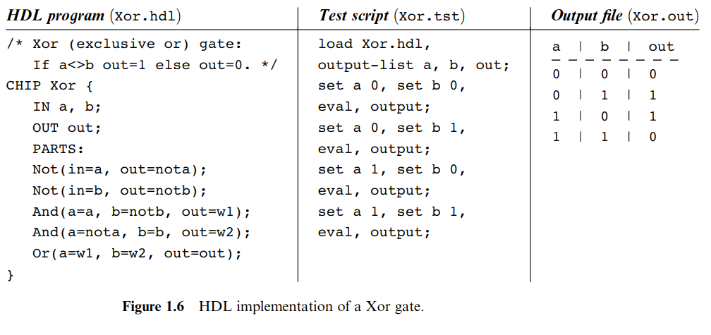

:subtitle: Boolean Algebras, VHDL, and forth
:relfileprefix: ../
:dir: blog/
include::{relfileprefix}README.adoc[tag=preamble]

:relfileprefix:

== {subtitle}

.nand2tetris Figure 1.6
> link:https://creativecommons.org/licenses/by-nc-sa/3.0/[CC BY-NC-SA 3.0]



=== HDL program

.using graphiz
> link:http://dreampuf.github.io/GraphvizOnline/#digraph%20G%20%7B%0A%0Aa%20-%3E%20nota%20%23%20NOT%0Ab%20-%3E%20notb%20%23%20NOT%0A%0A%7Ba%20notb%7D%20-%3E%20w1%20%23%20AND%0A%7Bnota%20b%7D%20-%3E%20w2%20%23%20AND%0A%0A%7Bw1%20w2%7D%20-%3E%20out%20%23%20OR%0A%0A%7D%0A[graphiz playground]

```dot
digraph G {

a -> nota # NOT
b -> notb # NOT

{a notb} -> w1 # AND
{nota b} -> w2 # AND

{w1 w2} -> out # OR

}
```

.using a made-up DSL:
> taking inspiration from graphiz and forth

```factor
:: xor ( a b -- out )
     a not :> nota
     b not :> notb

a notb and :> w1
nota b and :> w2

w1 w2  or  :> out
;
```

actually this is executable `factor` code, using
link:https://docs.factorcode.org/content/article-locals-examples.html[lexical variables].

****
here's the entire thing without using intermediate variables: 

```factor
:: xor ( a b -- out )
a b not and
a not b and
or
;
```

here's the entire thing just using stack manipulation: 
```factor
:: xor ( a b -- out )
2dup                      ! ( a b -- a b a b )
not and ! ( a b -- w1 )
swap                      ! ( a b -- a b b a )
not and ! ( b a -- w2 )
or
;
```

****

=== Test script
